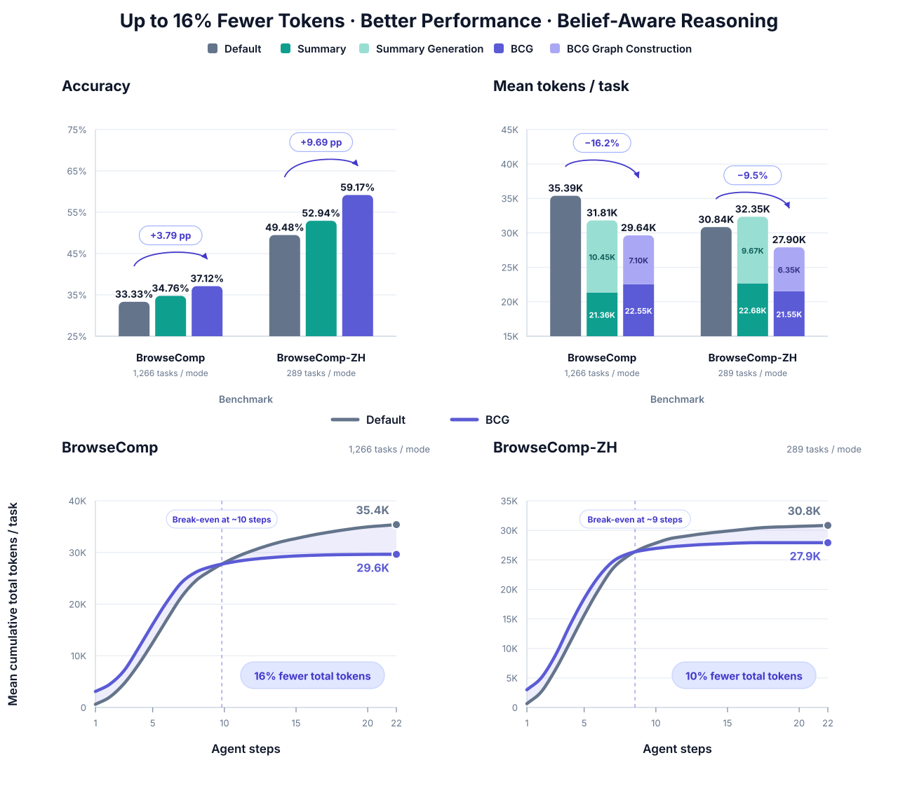
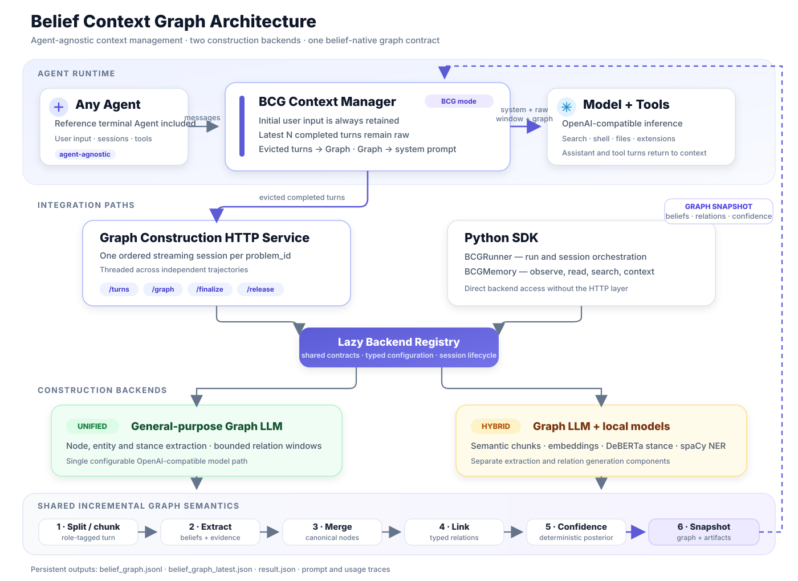

<div align="center">

# Belief Context Graph


**Belief-Aware Loops · Confidence-Driven Graphs**

[](https://www.python.org/)
[](https://opensource.org/licenses/MIT)
[](https://docs.astral.sh/uv/)
[](https://bigai-nlco.github.io/belief-context-graph/)
[](https://belief-context-graph.docs.buildwithfern.com/)

</div>

<p align="center">
  <a href="assert/benchmark_overview.svg">
    
  </a>
</p>

<p align="left"><sub><sub>Agent: gpt-5.6-luna with low-effort thinking · Graph/Summary: gpt-5.6-luna with thinking disabled · Harness: <a href="agent-cli/packages/agent-core/src/harness">repository harness</a></sub></sub></p>

## **Why Belief Context Graph**
**Current agent memory systems fall short.** Conversation memory preserves history. Vector memory retrieves similar fragments. GraphRAG extracts entities and relations. Trace memory records tool calls. Temporal KGs track facts over time.

> These systems answer **retrieval questions**: *which text is relevant? which entities are related? what happened in the past?*

But agents executing real tasks also need to answer **belief questions**:

> - Should I actually believe this fact?
> - Is it still valid, or has it expired?
> - Did it come from a reliable source?
> - Does it conflict with other evidence?
> - Is it certain enough to act on?
> - Did the outcome prove my prior belief wrong?


Belief Context Graph (`BCG`) upgrades agent memory from **retrieval memory** to **belief context graph**. It is a probabilistic, temporal, evidence-grounded and computational memory substrate that helps agents continuously maintain: what to believe, at what confidence, from which evidence, and whether uncertainty should block action. The result is agent memory you can query, audit, and trust.


## **Core capabilities:**

- **Belief Extraction:** Segment trajectories, extract structured beliefs that counts for agent reasoning and link them into a connected graph
- **Deterministic Confidence:** Auditable posterior confidence computed from `initial_confidence`, `evidence_confidence`, and relation-derived `factor_confidence`; source reliability and stance quality set the prior, while relation weights and activation thresholds propagate support or contradiction deterministically
- **Evidence Provenance:** Every belief carries exact-offset source references back to the originating conversation turn
- **Temporal Awareness:** Run-based lifecycle with sessions and timestamps — know when each belief was formed and how it evolved
- **Relation Linking:** Forward and backward relationship edges between beliefs, forming a casual decision graph/trace.

  

## Live Demo

https://github.com/user-attachments/assets/fa10c247-7f6f-4567-9a1f-648c79b1df44

---

<p align="center">
  <strong><a href="#quick-start">Quick Start</a></strong> &nbsp;·&nbsp;
  <strong><a href="#architecture">Architecture</a></strong> &nbsp;·&nbsp;
  <strong><a href="#gains-of-bcg-for-agentic-tasks">Case Study</a></strong> &nbsp;·&nbsp;
  <strong><a href="#project-status">Project Status</a></strong> &nbsp;·&nbsp;
  <strong><a href="#comparison-with-relevant-solutions">Comparison</a></strong> &nbsp;·&nbsp;
  <strong><a href="#contributing">Contributing</a></strong>
</p>

---


## Quick Start

Requires Python 3.11–3.13. The optional reference terminal Agent additionally requires Node.js 22.19+.

```bash
git clone https://github.com/bigai-nlco/belief-context-graph.git
cd belief-context-graph
make install
uv run bcg --version
```

Launch the bundled reference Agent to try BCG immediately — integrating BCG into your own Agent does not require this CLI:

```bash
uv run bcg
```

The first run walks you through model credentials, context mode, and Graph Construction backend, and saves your choices under `~/.bcg`. See the [documentation](https://belief-context-graph.docs.buildwithfern.com/) for everything else.


> 🔨 &ensp;`BCGRunner` — build the first belief context graph &ensp;→&ensp; [**Construct the first BCG**](https://belief-context-graph.docs.buildwithfern.com/quickstart) · [**Understand your graph**](https://belief-context-graph.docs.buildwithfern.com/first-graph)
>
> 🧠 &ensp;`BCGMemory` — query beliefs and assemble context  &ensp;→&ensp; [**Read Memory**](https://belief-context-graph.docs.buildwithfern.com/guides/python) · [**Memory Methods**](https://belief-context-graph.docs.buildwithfern.com/sdk/memory/observe-belief)
---

## Architecture

BCG is an optional context layer between an Agent and its model. In BCG mode, the initial user input and recent completed turns remain in the raw context, while older completed turns stream into Graph Construction; the resulting belief snapshot is then injected into the system prompt. Both the HTTP service and the Python SDK use the same backend registry, construction pipeline, confidence semantics, and graph artifacts.

<p align="center">
  <a href="assert/architecture.svg">
    
  </a>
</p>


---

## Gains of BCG for Agentic Tasks

This successful BrowseComp case (`browsecomp-0836`) shows Kimi K3 using belief identities and confidence from BCG instead of repeating an already completed search.

<p align="center">
  
</p>

---

## Project Status

BCG currently provides a belief-native memory SDK, unified and hybrid graph-construction backends, an optional HTTP service, a reference Agent integration, reproducible benchmark tooling, and graph visualization support. The next development phase focuses on two directions:

1. **A more principled probabilistic foundation.** Develop probability calculation and propagation methods that are more reasonable and better grounded in Bayesian inference or other mathematically justified uncertainty frameworks. This includes clarifying priors, likelihoods, evidence dependence, contradiction handling, graph-path effects, and calibration while preserving auditability.
2. **Deep Research.** Extend BCG from belief-aware context management toward a Deep Research workflow that can plan investigations, track source provenance and temporal validity, reconcile conflicting findings, identify missing evidence, and produce auditable research outputs.

---

## Comparison with Relevant Solutions

Agent memory systems serve different purposes. Below is a feature-level comparison of BCG against the most widely-used memory and knowledge graph solutions in the LLM agent ecosystem.

| | Mem0 | Zep | Letta (MemGPT) | LangChain Memory | LlamaIndex | TrustGraph | Semantica | **BCG** |
|---|---|---|---|---|---|---|---|---|
| **Belief-native extraction** |⚡ | ⚡|❌ |⚡ |⚡ |⚡ |⚡ |✅ |
| **Deterministic confidence** | ❌| ❌|❌ |❌ |❌ |❌ |⚡ |✅ |
| **Evidence provenance** | ⚡|✅ | ⚡| ⚡| ⚡| ✅|✅ | ✅|
| **Temporal lifecycle** | ⚡| ✅| ⚡| ⚡| ❌|⚡| ✅| ⚡|
| **Relation linking** |⚡ | ✅| ❌|❌ | ⚡| ✅| ✅| ✅|
| **Local-first artifacts** |⚡ | ❌| ✅| ⚡| ✅|✅ | ✅|✅ |
| **Graph queryability** | ❌| ✅|❌ |❌ | ⚡| ✅|✅ |⚡ |
| **Merge / dedup** |⚡ |✅ | ⚡|⚡ |⚡ |⚡ |✅ | ✅|
| **Conflict detection** |⚡ | ✅|❌ | ⚡| ❌|❌ |✅ | ✅|
| **Run without an independent DB** | ✅|✅ | ✅|✅ | ✅| ❌|✅ |✅ |

> ✅ Full support &nbsp;&nbsp; ⚡ Partial / optional &nbsp;&nbsp; ❌ Not supported

---

## Contributing

Contributions are welcome. Please read [CONTRIBUTING.md](CONTRIBUTING.md) before opening a pull request.

---

## License

MIT — see the [LICENSE](LICENSE) file for details.

---
