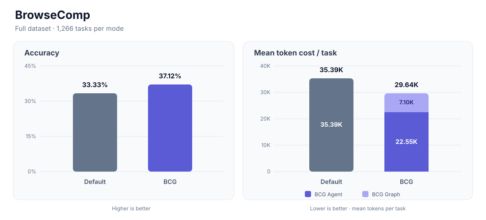
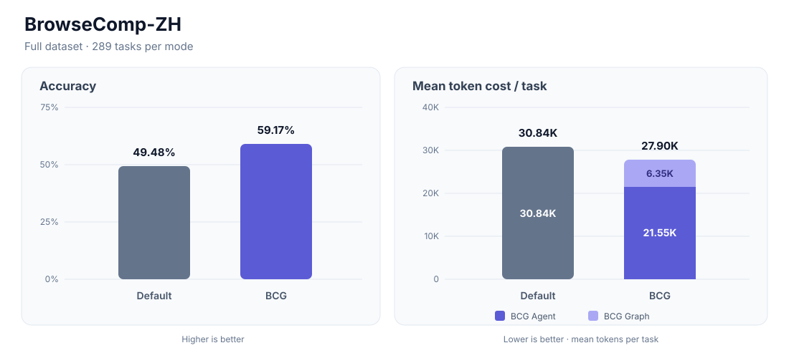
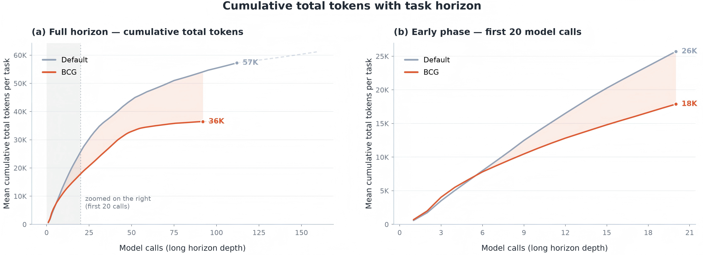
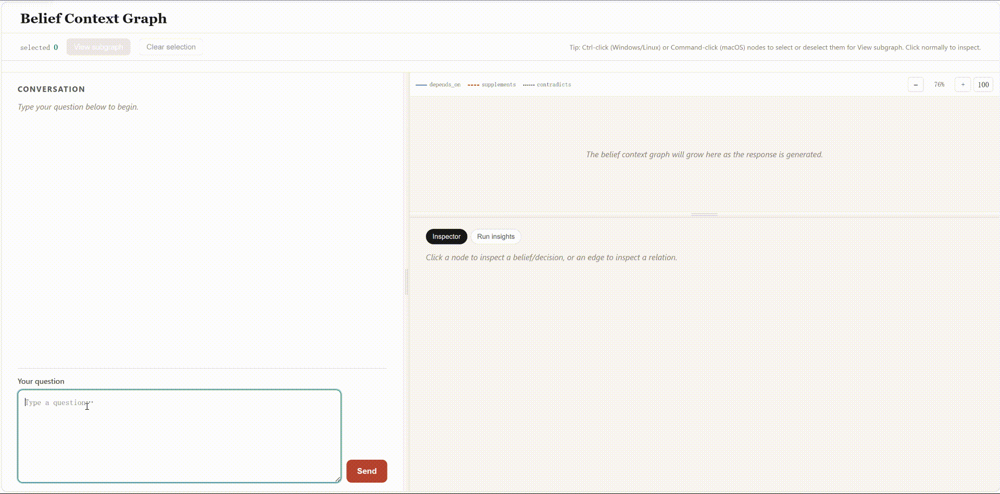

<div align="center">

# Belief Context Graph


**Probabilistic · Temporal · Explainable · Stateful**

[](https://www.python.org/)
[](https://opensource.org/licenses/MIT)
[](https://docs.astral.sh/uv/)
[](https://belief-context-graph.docs.buildwithfern.com/)

</div>

## **Why Belief Context Graph**
**Current agent memory systems fall short.** Conversation memory preserves history. Vector memory retrieves similar fragments. GraphRAG extracts entities and relations. Trace memory records tool calls. Temporal KGs track facts over time.

> These systems answer **retrieval questions**: *which text is relevant? which entities are related? what happened in the past?*

But agents executing real tasks also need to answer **belief questions**:

> - Should I actually believe this fact?
> - Is it still valid, or has it expired?
> - Did it come from a reliable source?
> - Does it conflict with other evidence?
> - Is it certain enough to act on?
> - Did the outcome prove my prior belief wrong?


Belief Context Graph (`BCG`) upgrades agent memory from **retrieval memory** to **belief context graph**. It is a probabilistic, temporal, evidence-grounded and computational memory substrate that helps agents continuously maintain: what to believe, at what confidence, from which evidence, and whether uncertainty should block action. The result is agent memory you can query, audit, and trust.


## **Core capabilities:**

- **Belief Extraction:** Segment trajectories, extract structured beliefs that counts for agent reasoning and link them into a connected graph
- **Deterministic Confidence:** Auditable posterior confidence computed from `initial_confidence`, `evidence_confidence`, and relation-derived `factor_confidence`; source reliability and stance quality set the prior, while relation weights and activation thresholds propagate support or contradiction deterministically
- **Evidence Provenance:** Every belief carries exact-offset source references back to the originating conversation turn
- **Temporal Awareness:** Run-based lifecycle with sessions and timestamps — know when each belief was formed and how it evolved
- **Relation Linking:** Forward and backward relationship edges between beliefs, forming a casual decision graph/trace.

  

<p align="center">
  
  
</p>

<p align="right">
  <sub><sub>Evaluation setup: GPT-5.6-luna Agent with <code>thinking=low</code> · BCG uses compact Graph Context in the system prompt, two recent completed turns, GPT-5.6-luna Graph Construction with reasoning disabled, and local <code>all-MiniLM-L6-v2</code> embeddings.</sub></sub>
</p>

---

<p align="center">
  <strong><a href="#live-demo">Live Demo</a></strong> &nbsp;·&nbsp;
  <strong><a href="#core-capabilities">Core Capabilities</a></strong> &nbsp;·&nbsp;
  <strong><a href="#quick-start">Quick Start</a></strong> &nbsp;·&nbsp;
  <strong><a href="#architecture">Architecture</a></strong> &nbsp;·&nbsp;
  <strong><a href="#case-study-turning-graph-uncertainty-into-a-targeted-search">Case Study</a></strong> &nbsp;·&nbsp;
  <strong><a href="#comparison-with-existing-memory-solutions">Comparison</a></strong> &nbsp;·&nbsp;
  <strong><a href="#contributing">Contributing</a></strong>
</p>

---

## Token cost across the task horizon

<p align="center">
  <a href="assert/readme_token_cost.png">
    
  </a>
</p>

- **Model calls.** The number of model calls (assistant turns) a task has made so far. Moving right means progressing deeper into the task horizon. The full-horizon figure shows the overall trend, while the accompanying zoomed-in figure focuses on the first 20 calls to make the early-phase behavior and crossover easier to see.
- **Mean cumulative tokens per task.** Tokens summed from the first call up to and including call *k*, then averaged over all 1,200 trajectories in that mode.


## Live Demo

<div align="center">



</div>


## Quick Start

Requires Python 3.11–3.13. The optional reference terminal Agent additionally requires Node.js 22.19+.

```bash
git clone https://github.com/bigai-nlco/belief-context-graph.git
cd belief-context-graph
make install
uv run bcg --version
```

Launch the bundled reference Agent to try BCG immediately — integrating BCG into your own Agent does not require this CLI:

```bash
uv run bcg
```

The first run walks you through model credentials, context mode, and Graph Construction backend, and saves your choices under `~/.bcg`. See the [documentation](https://belief-context-graph.docs.buildwithfern.com/) for everything else.


---

## Architecture

BCG is an optional context layer between an Agent and its model. In BCG mode, the initial user input and recent completed turns remain in the raw context, while older completed turns stream into Graph Construction; the resulting belief snapshot is then injected into the system prompt. Both the HTTP service and the Python SDK use the same backend registry, construction pipeline, confidence semantics, and graph artifacts.

<p align="center">
  <a href="assert/architecture.svg">
    
  </a>
</p>

---

## Benchmark Adapter

The reference Agent can be evaluated head-to-head in Default mode vs. BCG mode against **BrowseComp** and **BrowseComp (ZH)**, using the same Agent model, prompt, and scorer in both modes — isolating the effect of graph-backed context from every other variable.

```bash
bcg benchmark run browsecomp browsecomp_zh --modes default,bcg \
    --thinking off \
    --max-problems 100 \
    --workers 8 \
    --output-dir results/browsecomp-comparison
```

See [Evaluate with benchmarks](https://belief-context-graph.docs.buildwithfern.com/operate/benchmarking) in the documentation for dataset setup, scoring, output artifacts, and every `bcg benchmark run` option.

---

## Case Study: Turning graph uncertainty into a targeted search

This BrowseComp case shows how BCG can influence an Agent's next action, rather than simply supplying retrieved text.

> **Task**
>
> Identify a 1940s short story from clues involving a man in sandals, a stamp collector, and a 64-page magazine published by a company whose name contains *Pendulum*.

> **Graph state**
>
> After several searches, the Agent's system context contained two high-confidence beliefs pointing toward a candidate, but neither belief directly established the distinctive plot connection:
>
> ```text
> [B72] A 1946 pulp-fiction listing identifies "White Mouse" as by Thornton Ayre, the pen name associated with John Russell Fearn. (confidence 0.98)
>
> [B73] A search result for The Multi-Man by John Russell Fearn mentions a white mouse being given the correct treatment. (confidence 0.98)
> ```

> **Agent decision**
>
> Graph decision: The leading candidate is “White Mouse” (B72/B73), while the plot evidence is indirect; I’ll search the distinctive breath/death wording to test that candidate against alternatives.
>
> **Tool call**
>
> ```json
> {
>   "name": "web_search",
>   "arguments": {"query": "\"stamp collector's breath\" story"}
> }
> ```

**What BCG contributed**

The Agent did not treat `confidence 0.98` as proof that the candidate was correct. It separated confidence in the recorded metadata from confidence in the missing plot-level connection, cited the beliefs behind its current hypothesis, and searched for the exact evidence needed to distinguish that hypothesis from alternatives. The resulting Graph-to-action path is explicit and auditable.

The displayed statement is a concise decision summary emitted for this case study, not the model's private chain-of-thought.

<sub>This diagnostic trace demonstrates observability rather than answer quality; the task's final answer was incorrect.</sub>

## Comparison with Existing Memory Solutions

Agent memory systems serve different purposes. Below is a feature-level comparison of BCG against the most widely-used memory and knowledge graph solutions in the LLM agent ecosystem.

| | Mem0 | Zep | Letta (MemGPT) | LangChain Memory | LlamaIndex | TrustGraph | Semantica | **BCG** |
|---|---|---|---|---|---|---|---|---|
| **Belief-native extraction** |⚡ | ⚡|❌ |⚡ |⚡ |⚡ |⚡ |✅ |
| **Deterministic confidence** | ❌| ❌|❌ |❌ |❌ |❌ |⚡ |✅ |
| **Evidence provenance** | ⚡|✅ | ⚡| ⚡| ⚡| ✅|✅ | ✅|
| **Temporal lifecycle** | ⚡| ✅| ⚡| ⚡| ❌|⚡| ✅| ⚡|
| **Relation linking** |⚡ | ✅| ❌|❌ | ⚡| ✅| ✅| ✅|
| **Local-first artifacts** |⚡ | ❌| ✅| ⚡| ✅|✅ | ✅|✅ |
| **Graph queryability** | ❌| ✅|❌ |❌ | ⚡| ✅|✅ |⚡ |
| **Merge / dedup** |⚡ |✅ | ⚡|⚡ |⚡ |⚡ |✅ | ✅|
| **Conflict detection** |⚡ | ✅|❌ | ⚡| ❌|❌ |✅ | ✅|
| **Run without an independent DB** | ✅|✅ | ✅|✅ | ✅| ❌|✅ |✅ |

> ✅ Full support &nbsp;&nbsp; ⚡ Partial / optional &nbsp;&nbsp; ❌ Not supported

---

## Contributing

Contributions are welcome. Please read [CONTRIBUTING.md](CONTRIBUTING.md) before opening a pull request.

---

## License

MIT — see the [LICENSE](LICENSE) file for details.

---
